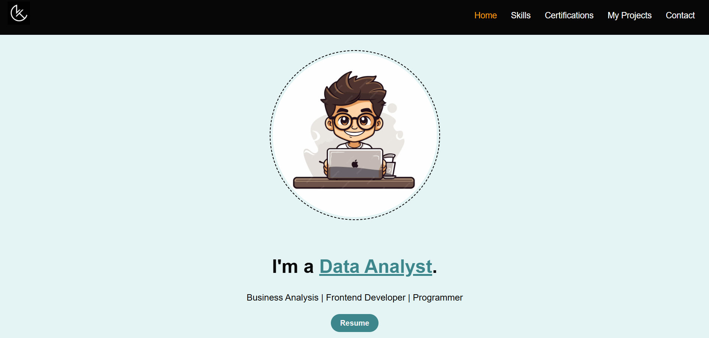
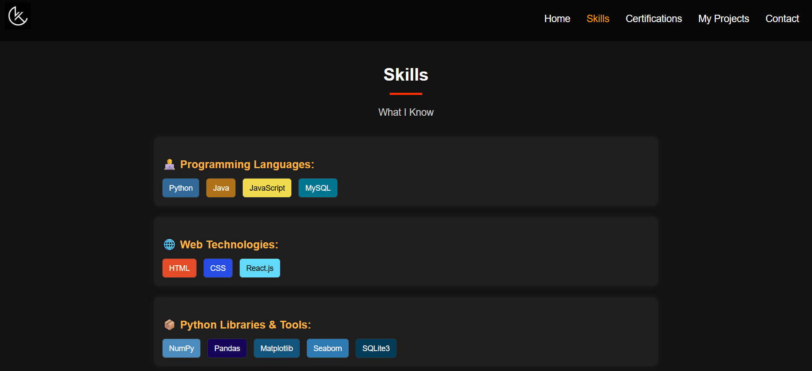
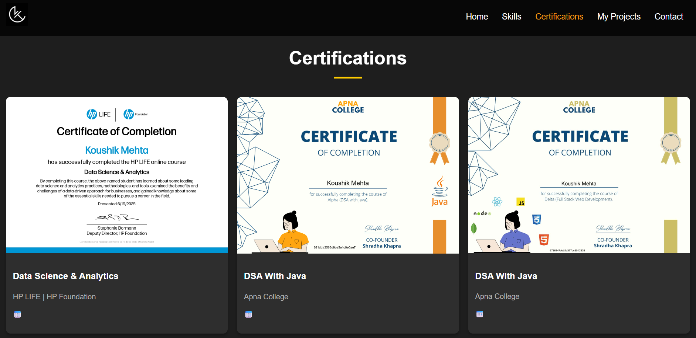
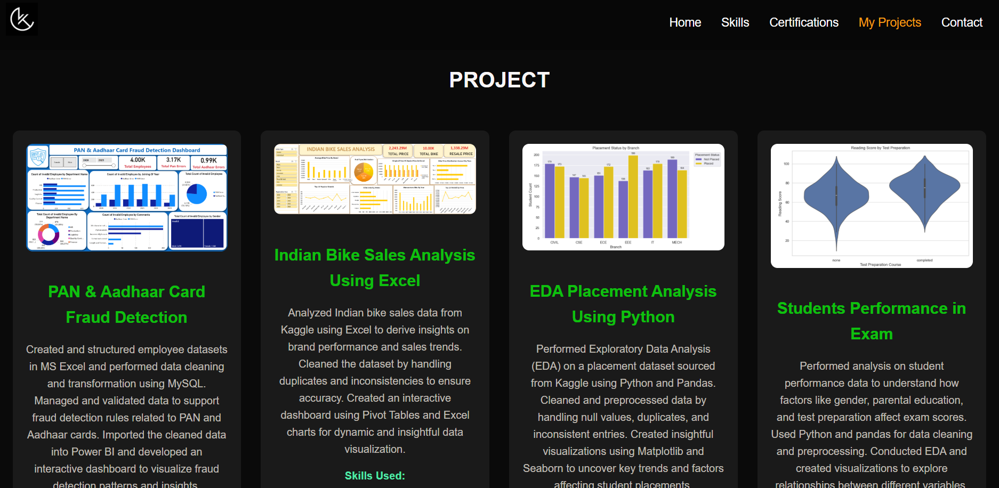
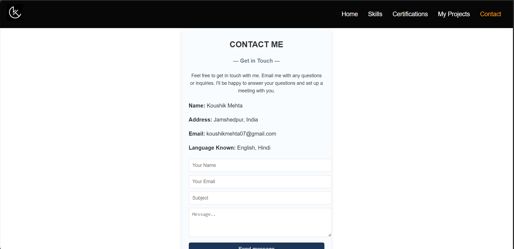
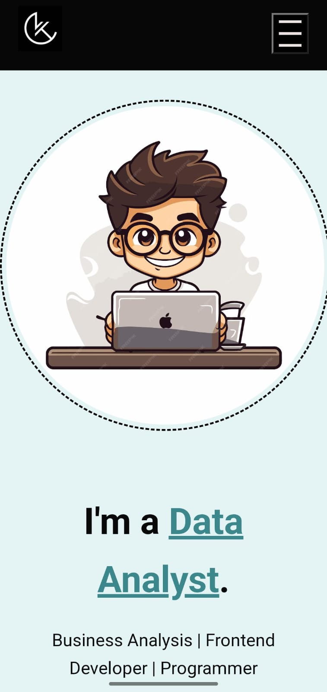

# Portfolio
This project is a fully responsive portfolio website built using **React.js**, **HTML**, **CSS**, and **JavaScript**. The portfolio includes smooth navigation via **React Router** and highlights key sections like **Skills**, **Certifications**, **Projects**, and **Contact**. It features interactive icons for a modern user experience and is deployed on **Vercel** for fast and reliable performance.

## Usage

- Open your browser and go to `https://personal-portfolio-beige-three-23.vercel.app/` to view the portfolio.
- Navigate between different sections like **About Me**, **Projects**, **Skills**, and **Contact** using **React Router**.
- The portfolio is fully responsive, so it works well on mobile devices, tablets, and desktops.

## Features

- Fully responsive design, adaptable to desktop, tablet, and mobile.
- Smooth navigation via **React Router**.
- Key sections: **Skills**, **Certifications**, **Projects**, and **Contact**.
- Interactive icons for a modern and engaging user experience.
- Fast and reliable hosting via **Vercel**.

## Technologies Used

- **React.js** – JavaScript library for building user interfaces.
- **HTML5** – Structuring the web pages.
- **CSS3** – For styling the portfolio.
- **JavaScript** – For dynamic functionality.
- **React Router** – For smooth navigation between sections.
- **Vercel** – For deployment.
## Screenshots

### Homepage

The homepage serves as the main entry point of the portfolio, featuring a clean layout with sections for an **Introduction**, **Skills**, **Projects**, and **Contact**. The **smooth navigation** is enabled through **React Router**, making it easy to switch between different sections. This page is designed to be **responsive**, so it looks great on both desktops and mobile devices.

### Skills Section

The **Skills** section showcases a set of interactive icons representing various technologies and programming languages like **JavaScript**, **React.js**, **Node.js**, and others. Each icon is clickable, providing additional information about the skill and my expertise in it. This section is designed to be **interactive** and provides an engaging way for visitors to explore my technical capabilities.

### Certifications Section

The **Certifications** section highlights my professional certifications and achievements. Each certification is represented by a clickable icon that leads to a detailed explanation. The section is neatly organized to make it easy for visitors to see my credentials at a glance.

### Projects Section

The **Projects** section displays a collection of projects I’ve worked on. Each project is accompanied by a short description, technologies used, and a link to the live project or its source code. The design is clean and easy to navigate, allowing visitors to explore my work in detail.

### Contact Section

The **Contact** section includes a contact form and my personal details like email and social media profiles. Visitors can easily reach out to me directly through the form or connect with me on **LinkedIn** or **GitHub**. It’s designed to be simple and user-friendly.

### Mobile View

The mobile view ensures that the portfolio is fully **responsive**, providing a seamless experience on smaller screens. The layout adapts to fit smaller device widths, and navigation remains easy and intuitive, ensuring visitors on mobile devices can explore all sections without issues.

Or, view the live demo at [Portfolio Demo](https://personal-portfolio-beige-three-23.vercel.app/)

